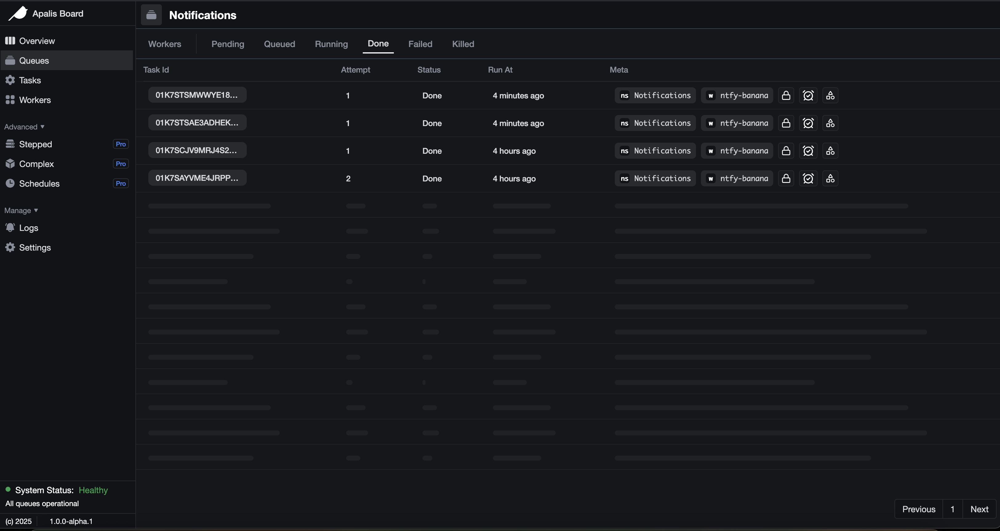
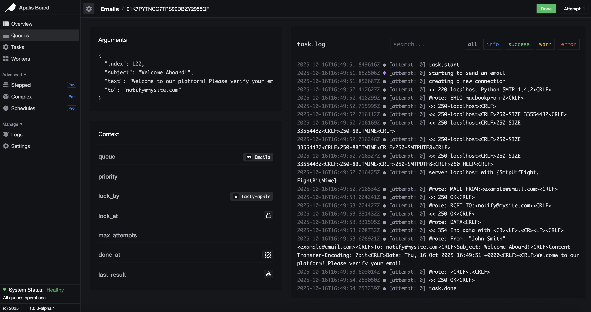
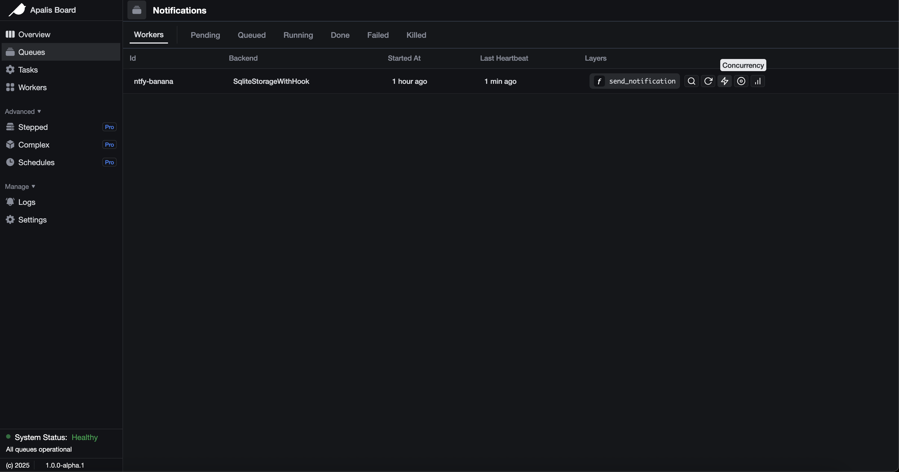
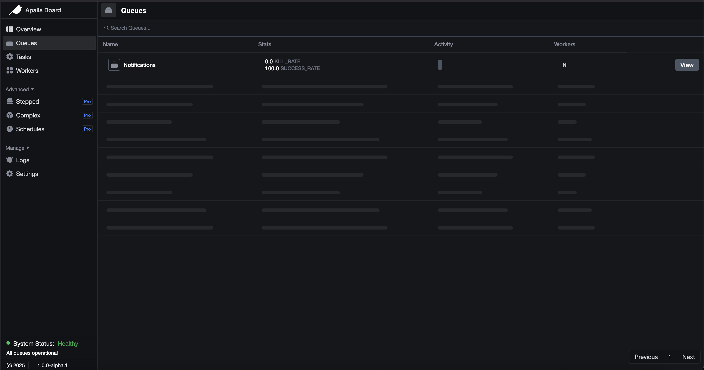

#  apalis-board

[](https://github.com/apalis-dev/apalis-board/actions/workflows/ci.yml)
[](https://github.com/apalis-dev/apalis-board/actions/workflows/rust-ci.yml)
[](https://github.com/apalis-dev/apalis-board/actions/workflows/frontend-build.yml)
[](https://github.com/apalis-dev/apalis-board/actions/workflows/security.yml)
[](https://codecov.io/gh/apalis-dev/apalis-board)

Apalis board contains a number of crates useful for building UIs and apis for [apalis](https://github.com/geofmureithi/apalis) backends.


**Key features:**
- Visualize your queues and jobs in real time
- Beautiful UI to track job status and progress
- Perform actions on jobs directly from the dashboard
- Gain insights into queue health and worker activity
- Easily integrate with existing apalis-based services
- Streamline job management and debugging

Get a clear overview of what's happening in your queues and manage jobs efficiently.

## Screenshots

### Tasks



### Single Task



### Workers



### Queues



## Building the frontend

```sh
cd crates/board
trunk build
```

## Examples

- axum-email-service : Basic example that shows how to send emails via smtp using `lettre` and `axum`
- actix-ntfy-service : Basic example that shows how to publish notifications using `ntfy.sh` and `actix`

## Backlog

- [ ] Complete the TaskPage
- [ ] Improve the Logs Page
- [ ] Some more cleanup?

## Acknowledgments
- https://github.com/felixmosh/bull-board
